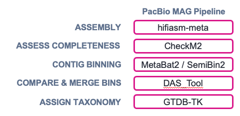

# PacBio Metagenome Assembly (MAG) Pipeline


For more information regarding the PacBio WGS Variant Pipeline, see the links below:

- [GitHub](https://github.com/PacificBiosciences/HiFi-MAG-WDL) ([Additional docs](https://github.com/PacificBiosciences/pb-metagenomics-tools/blob/master/docs/Tutorial-HiFi-MAG-Pipeline.md))


# 1. Prerequisites
If you have not yet run through the prerequisites on the [home page](https://github.com/RhettRautsaw/EDIT_THIS_PAGE), please do that before continuing. 

SSH into the NCShare compute cluster (if you are not already logged in).

```
ssh username@login.ncshare.org
```

# 2. Download and Setup WDL/Resources

## Download PacBio Metagenome Assembly (MAG) Pipeline
```
git clone \
  --depth 1 --branch v1.0.1 --recursive \
  https://github.com/PacificBiosciences/HiFi-MAG-WDL \
  HiFi-MAG-WDL_v1.0.1
```

## Download Reference Resources
The pipeline requires two publicly licensed reference databases – UniRef100 and the Genome Taxonomy Database Toolkit (GTDB-Tk). For convenience and to save time, I've pre-downloaded the data:

Reference Bundle Directory:
```
/work/rrautsaw1/MAG_resources
```

>For instructions on downloading the reference databases yourself, visit [HiFi-MAG-WDL GitHub Page](https://github.com/PacificBiosciences/HiFi-MAG-WDL/tree/main/backends/hpc)

## Download Example Data (optional)
Finally, we need some data to analyze. 

If you don't have your own data, then you can use one of [PacBio's Example Datasets](https://www.pacb.com/connect/datasets/). I have pre-downloaded one replicate of the ZymoBIOMICS Fecal Reference with TruMatrix Technology (human) sequenced on a Revio SMRT Cell. 

> For instructions on downloading the example dataset yourself, see the code below:
> ```
> wget https://downloads.pacbcloud.com/public/revio/2023Q3/ZymoTrumatrix/m84028_230113_224423_s1.hifi_reads.bam
> pbindex -j 8 m84028_230113_224423_s1.hifi_reads.bam
> samtools view -@ 8 -s 0.25 -b m84028_230113_224423_s1.hifi_reads.bam > m84028_230113_224423_s1.hifi_reads.subset.bam
> ```

# 3. Setup Input Files
The primary input for miniwdl and the MAG Pipeline is a JSON file with information such as the sample ID, HiFi bam file locations, and the location of the reference databases. 

`input.hpc.json`
```
{
	"metagenomics.sample_id": "ZymoBIOMICS",
	"metagenomics.hifi_reads_bam": "/work/rrautsaw1/MAG_resources/m84028_230113_224423_s1.hifi_reads.bam",
	"metagenomics.checkm2_ref_db": "/work/rrautsaw1/MAG_resources/uniref100.KO.1.dmnd",
	"metagenomics.gtdbtk_data_tar_gz": "/work/rrautsaw1/MAG_resources/gtdbtk_r207_v2_data.tar.gz",
	"metagenomics.backend": "HPC",
	"metagenomics.preemptible": true
}
```

Optional parameters to add if needed:
```
"metagenomics.min_contig_length": "Int (optional, default = 500000)",
"metagenomics.min_contig_completeness": "Int (optional, default = 93)",
"metagenomics.metabat2_min_contig_size": "Int (optional, default = 30000)",
"metagenomics.semibin2_model": "String (optional, default = \"global\")",
"metagenomics.dastool_search_engine": "String (optional, default = \"diamond\")",
"metagenomics.dastool_score_threshold": "Float (optional, default = 0.2)",
"metagenomics.min_mag_completeness": "Int (optional, default = 70)",
"metagenomics.max_mag_contamination": "Int (optional, default = 10)",
"metagenomics.max_contigs": "Int (optional, default = 20)",
"metagenomics.container_registry": "String? (optional)",
```

# 4. Run MAG Pipeline
miniwdl is a workflow manager that submits a series of parallel jobs to your HPC. Generally, this must be run from the login/head node; therefore, you need to either (1) maintain an active connection until the workflow completes or (2) run the workflow in the background so that if SSH connection to your HPC is lost, the workflow will continue. 

We will use `tmux` to setup background jobs.

```
tmux new -s ZymoBIOMICS_MAG 

miniwdl run HiFi-MAG-WDL_v1.0.1/workflows/main.wdl \
	--input input.hpc.json \
	--dir ZymoBIOMICS_MAG
```

Detach tmux session by hitting `Ctrl+b` and then `d`. This will allow miniwdl to continue running in the background. If you'd like to view progress and the output of miniwdl, you can reattach your session by typing:

```
tmux attach -t ZymoBIOMICS_MAG
```

Once miniwdl completes, you can close the tmux session by typing exit in the attached session

# 5. Understanding the Output
A directory named `ZymoBIOMICS_MAG` will be created and inside these directories will be another dated directory with the format (`YYYYMMDD_HHMMSS_metagenomics`) corresponding to when the workflow was started. If a workflow needs to be restarted, you can submit the same command and it will create a second dated directory and cache the successful parts of the previous run to get to completion faster.

Inside `ZymoBIOMICS_MAG/YYYYMMDD_HHMMSS_metagenomics`, you will find several `call-*` directories which are the working directories for different parts of the workflow. Unless you are attempting to troubleshoot why your workflow is failing, these can be ignored. 

Focus on the `out` directory and `outputs.json` file as the final outputs. In particular, the `out` directory will contain several sub-directories for different tasks in the workflow. You can find a full description of each of these directories here [(Output Directories Docs)](https://github.com/PacificBiosciences/HiFi-MAG-WDL/tree/main?tab=readme-ov-file#workflow-outputs).

If this is a family analysis, you may yet find subdirectories beneath this for each sample in your family. These will be numbered based on the order they are supplied in the input WDL. For example:
```
ZymoBIOMICS_MAG/
 └── 20240903_131313_metagenomics/
      └── out/
          └── assembled_contigs_fa_gz/
              └── 0
                  └── ZymoBIOMICS_MAG
```