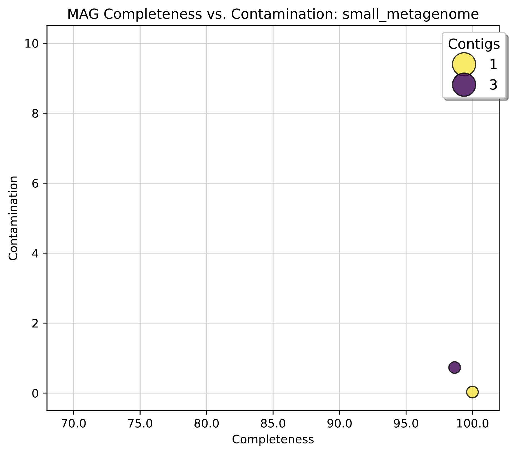
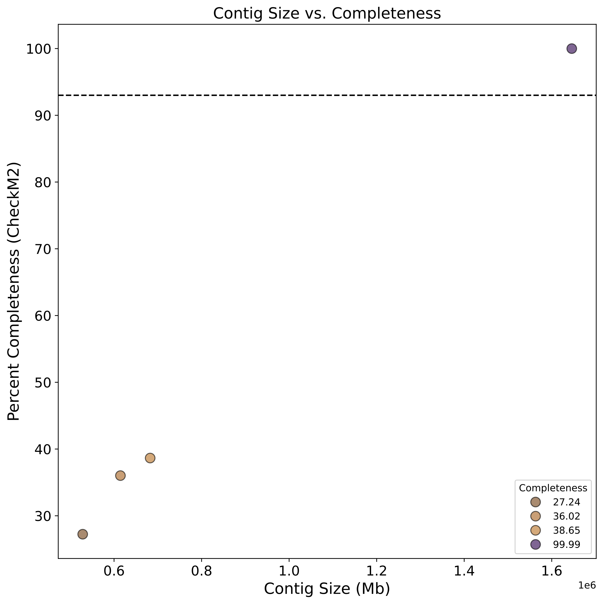
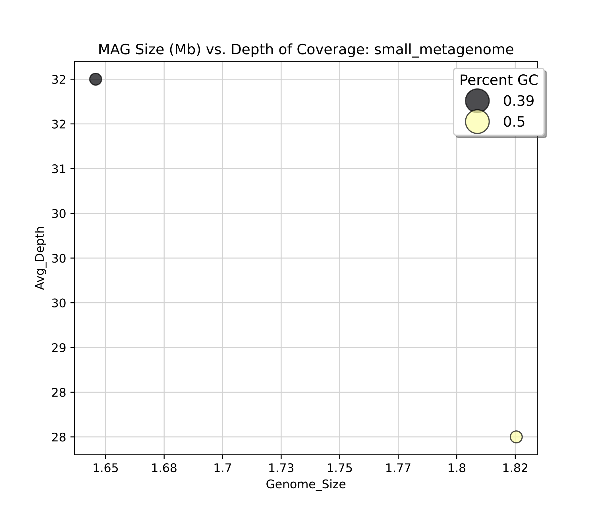
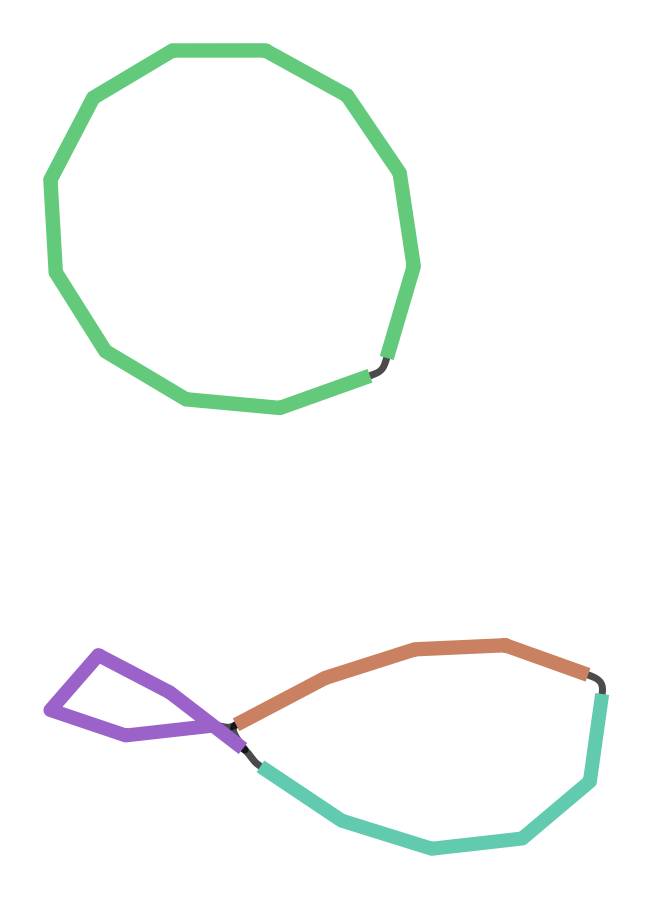

# PacBio Metagenome Assembly (MAG) Pipeline


For more information regarding the PacBio MAG Pipeline, see the links below:

- [GitHub](https://github.com/PacificBiosciences/HiFi-MAG-WDL) ([Additional docs](https://github.com/PacificBiosciences/pb-metagenomics-tools/blob/master/docs/Tutorial-HiFi-MAG-Pipeline.md))


# 1. Prerequisites
If you have not yet run through the prerequisites on the [home page](https://github.com/RhettRautsaw/PreMiEr_PacBio_tutorial), please do that before continuing. 

SSH into the NCShare compute cluster (if you are not already logged in) and navigate to your work directory.

```
ssh -i ~/.ssh/id_ed25519 username@login.ncshare.org

cd /work/username
```

# 2. Download and Setup WDL/Resources

## Download PacBio Metagenome Assembly (MAG) Pipeline
```
git clone \
  --depth 1 --branch v1.0.1 --recursive \
  https://github.com/PacificBiosciences/HiFi-MAG-WDL \
  HiFi-MAG-WDL_v1.0.1
```

## Download Reference Resources
The pipeline requires two publicly licensed reference databases – UniRef100 and the Genome Taxonomy Database Toolkit (GTDB-Tk). For convenience and to save time, we have pre-downloaded the data – **no download needed for this tutorial!**

Reference Bundle Directory:
```
ls /data/premier_workshop/pacbio_mag_resources/gtdbtk_r207_v2_data.tar.gz
ls /data/premier_workshop/pacbio_mag_resources/uniref100.KO.v1.dmnd
```

<details>
<summary> Optional details for downloading resources</summary>

> ⚠️**DO NOT RUN FOR TUTORIAL**⚠️<br>
> Downloading the reference databases is **NOT REQUIRED** for this tutorial. <br>
> The data is available at `/data/premier_workshop/pacbio_mag_resources` 

See [HiFi-MAG-WDL GitHub](https://github.com/PacificBiosciences/HiFi-MAG-WDL/tree/main/backends/hpc#reference-data) page for more details.

```
mkdir -p /data/premier_workshop/pacbio_mag_resources
cd /data/premier_workshop/pacbio_mag_resources

wget https://data.ace.uq.edu.au/public/gtdb/data/releases/release207/207.0/auxillary_files/gtdbtk_r207_v2_data.tar.gz
wget https://zenodo.org/records/4626519/files/uniref100.KO.v1.dmnd.gz
gunzip uniref100.KO.v1.dmnd.gz
```
</details>

## Download Example Data (optional)
Finally, we need some data to analyze. 

If you don't have your own data, then you can use one of [PacBio's Example Datasets](https://www.pacb.com/connect/datasets/). I have pre-downloaded and created a small metagenome dataset from two cultured bacterial samples - **no downloaded needed for this tutorial.**

Small metagenome dataset:
```
ls /data/premier_workshop/pacbio_mag_resources/small_metagenome.bam
```

<details>
<summary> Optional details for downloading/creating small metagenome dataset</summary>

> ⚠️**DO NOT RUN FOR TUTORIAL**⚠️<br>
> Downloading the example database is **NOT REQUIRED** for this tutorial. <br>
> The data is available at `/data/premier_workshop/pacbio_mag_resources` 
```
# Download pbtk
wget https://github.com/PacificBiosciences/pbtk/releases/download/v3.5.0/pbtk.tar.gz
mkdir pbtk; tar xvzf pbtk.tar.gz -C pbtk; rm pbtk.tar.gz

# Download Helicobacter pylori J99 dataset
wget https://downloads.pacbcloud.com/public/dataset/2021-11-Microbial-96plex/demultiplexed-reads/m64004_210929_143746.bc2009.bam
pbtk/pbindex m64004_210929_143746.bc2009.bam

# Download Methanocorpusculum labreanum Z dataset
wget https://downloads.pacbcloud.com/public/dataset/2021-11-Microbial-96plex/demultiplexed-reads/m64004_210929_143746.bc2061.bam
pbtk/pbindex m64004_210929_143746.bc2061.bam

# Merge datasets
samtools merge -o small_metagenome.bam m64004_210929_143746.bc2009.bam m64004_210929_143746.bc2061.bam
pbtk/pbindex small_metagenome.bam
```
</details>

<br>

# 3. Setup Input Files
The primary input for miniwdl and the MAG Pipeline is a JSON file with information such as the sample ID, HiFi bam file locations, and the location of the reference databases. I have already placed the input file for this tutorial in this repository directory.

`input.hpc.json`
```
{
  "metagenomics.sample_id": "small_metagenome",
  "metagenomics.hifi_reads_bam": "/data/premier_workshop/pacbio_mag_resources/small_metagenome.bam",
  "metagenomics.checkm2_ref_db": "/data/premier_workshop/pacbio_mag_resources/uniref100.KO.v1.dmnd",
  "metagenomics.gtdbtk_data_tar_gz": "/data/premier_workshop/pacbio_mag_resources/gtdbtk_r207_v2_data.tar.gz",
  "metagenomics.backend": "HPC",
  "metagenomics.preemptible": true
}
```
<details>
<summary>Optional parameters to add if needed:  </summary>

```
"metagenomics.min_contig_length": "Int (optional, default = 500000)",
"metagenomics.min_contig_completeness": "Int (optional, default = 93)",
"metagenomics.metabat2_min_contig_size": "Int (optional, default = 30000)",
"metagenomics.semibin2_model": "String (optional, default = \"global\")",
"metagenomics.dastool_search_engine": "String (optional, default = \"diamond\")",
"metagenomics.dastool_score_threshold": "Float (optional, default = 0.2)",
"metagenomics.min_mag_completeness": "Int (optional, default = 70)",
"metagenomics.max_mag_contamination": "Int (optional, default = 10)",
"metagenomics.max_contigs": "Int (optional, default = 20)",
"metagenomics.container_registry": "String? (optional)",
```
</details>

<br> 

# 4. Run MAG Pipeline
miniwdl is a workflow manager that submits a series of parallel jobs to your HPC. Generally, this must be run from the login/head node; therefore, you need to either (1) maintain an active connection until the workflow completes or (2) run the workflow in the background so that if SSH connection to your HPC is lost, the workflow will continue. 

We will use `tmux` to setup background jobs.

```
tmux new -s MAG_WDL 

miniwdl run HiFi-MAG-WDL_v1.0.1/workflows/main.wdl \
	--input PreMiEr_PacBio_tutorial/MAG_Pipeline/input.hpc.json \
	--dir MAG_WDL_OUT \
	--verbose
```

Detach tmux session by hitting `Ctrl+b` and then `d`. This will allow miniwdl to continue running in the background. If you'd like to view progress and the output of miniwdl, you can reattach your session by typing:

```
tmux attach -t MAG_WDL
```

Once miniwdl completes, you can close the tmux session by typing `exit` in the attached session

# 5. Understanding the Output
A directory named `MAG_WDL_OUT` will be created and inside these directories will be another dated directory with the format (`YYYYMMDD_HHMMSS_metagenomics`) corresponding to when the workflow was started. If a workflow needs to be restarted, you can submit the same command and it will create a second dated directory and cache the successful parts of the previous run to get to completion faster.

Inside `MAG_WDL_OUT/YYYYMMDD_HHMMSS_metagenomics`, you will find several `call-*` directories which are the working directories for different parts of the workflow. Unless you are attempting to troubleshoot why your workflow is failing, these can be ignored. 

Focus on the `out` directory and `outputs.json` file as the final outputs. In particular, the `out` directory will contain several sub-directories for different tasks in the workflow. You can find a full description of each of these directories here [(Output Directories Docs)](https://github.com/PacificBiosciences/HiFi-MAG-WDL/tree/main?tab=readme-ov-file#workflow-outputs).
```
MAG_WDL_OUT/
 └── 20250325_004446_metagenomics/
      └── out/
          └── mag_summary_txt/
              └── small_metagenome.HiFi_MAG.summary.txt
```

## View summary
```
cat /out/mag_summary_txt/small_metagenome.HiFi_MAG.summary.txt
```

| Name | Completeness | Contamination | Contig_Number | Contig_Names | Contig_Lengths | Contig_Depths | Avg_Depth | Coding_Density | Average_Gene_Length | Genome_Size | GC_Content | Total_Coding_Sequences | Classification |
| -- | -- | -- | -- | -- | -- | -- | -- | -- | -- | -- | -- | -- | -- |
| small_metagenome.complete.1 | 99.99 | 0.03 | 1 | s0.ctg000001c | 1645757 | 32 | 32 | 0.904 | 328.160502 | 1645757 | 0.39 | 1514 | d__Bacteria; <br> p__Campylobacterota; <br> c__Campylobacteria; <br> o__Campylobacterales; <br> f__Helicobacteraceae; <br> g__Helicobacter; <br> s__Helicobacter pylori_BU |
| small_metagenome.metabat2.1 | 98.65 | 0.73 | 3 | s5.ctg000006l, s5.ctg000007l, s5.ctg000008l | 614570, 528360, 682506 | 27, 30, 28 | 28 | 0.877 | 293.0372603 | 1825436 | 0.5 | 1825 | d__Archaea; <br> p__Halobacteriota; <br> c__Methanomicrobia; <br> o__Methanomicrobiales; <br> f__Methanocorpusculaceae; <br> g__Methanocorpusculum; <br> s__Methanocorpusculum labreanum |


## View plots
| Completeness vs Contamination | Completeness vs Size | Genome Sizes vs Depths |
| -- | -- | -- |
|  |  |  |


## Make Bandage Plot of Complete MAGs
[Bandage](https://rrwick.github.io/Bandage/) is a program that can be used to visualize assembly graphs.
```
cd out/assembled_contigs_gfa
cut -f5 ../mag_summary_txt/small_metagenome.HiFi_MAG.summary.txt | perl -pe 's/, /\n/g' > mag_contigs.txt
grep -f mag_contigs.txt small_metagenome.asm.p_ctg.gfa > NEW.gfa
```

<center></center>