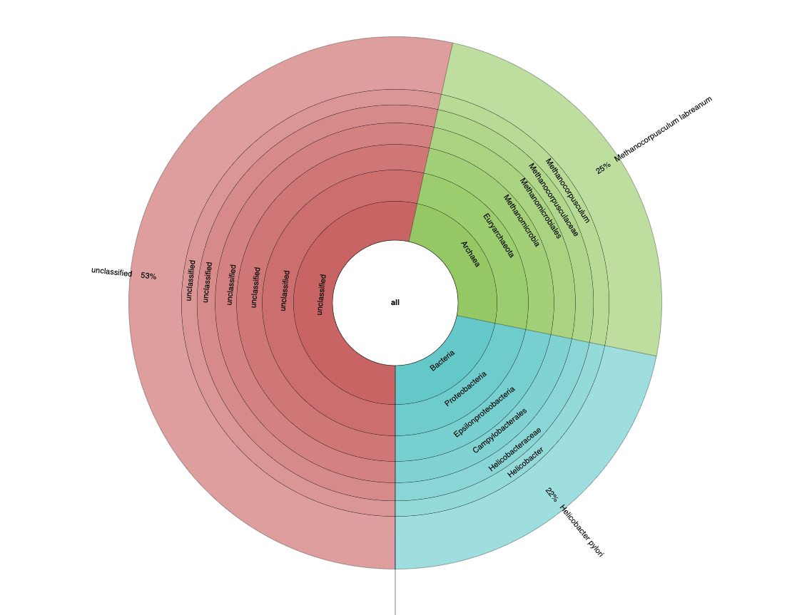
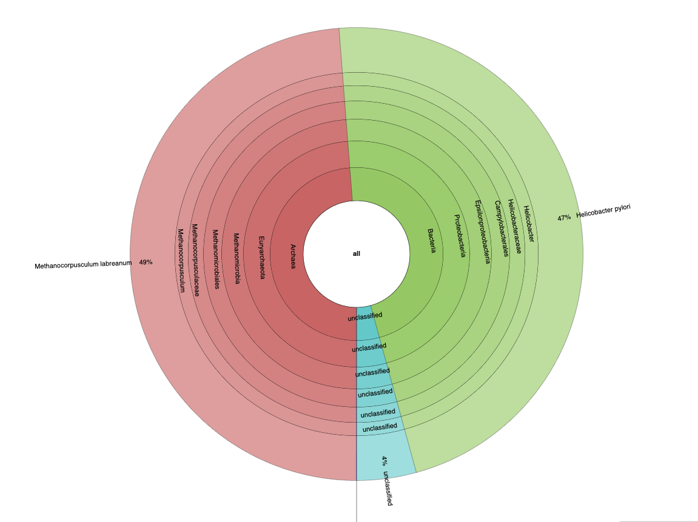

# PacBio Metagenome Taxonomic Profiling Pipeline


For more information regarding the Sourmash Metagenome Taxonomic Profiling Pipeline, see the link below:

- [GitHub](https://github.com/PacificBiosciences/pb-metagenomics-tools/tree/master/Taxonomic-Profiling-Sourmash)


# 1. Prerequisites
If you have not yet run through the prerequisites on the [home page](https://github.com/RhettRautsaw/PreMiEr_PacBio_tutorial), please do that before continuing. 

SSH into the NCShare compute cluster (if you are not already logged in) and navigate to your work directory.

```
ssh -i ~/.ssh/id_ed25519 username@login.ncshare.org

cd /work/username
```

# 2. Download and Setup WDL/Resources

## Download pb-metagenomics-tools Repository
```
git clone https://github.com/PacificBiosciences/pb-metagenomics-tools

# Pull out the Taxonomic-Profiling-Sourmash directory
mv pb-metagenomics-tools/Taxonomic-Profiling-Sourmash .
rm -rf pb-metagenomics-tools
```

## Reference Resources
The pipeline requires taxonomic k-mer databases provided by [Sourmash](https://sourmash.readthedocs.io/en/latest/databases.html). For convenience and to save time, we have pre-downloaded the bacteria and archaea databases – **no download needed for this tutorial!**

Reference Databases:
```
ls /data/premier_workshop/pacbio_mag_resources/sourmash-db/genbank-2022*
```

<details>
<summary> Optional details for downloading resources</summary>

> ⚠️**DO NOT RUN FOR TUTORIAL**⚠️<br>
> Downloading the dataset is **NOT REQUIRED** for this tutorial. <br>
> The data is already available at `/data/premier_workshop/pacbio_mag_resources/` 

See [pb-metagenomics-tools GitHub](https://github.com/PacificBiosciences/pb-metagenomics-tools/blob/master/docs/Tutorial-Taxonomic-Profiling-Sourmash.md) page for more details. Here I am only downloading the bacteria and archaea databases – however there are also databases for viral, protozoa, and fungal.

```
mkdir -p /data/premier_workshop/pacbio_mag_resources/sourmash-db
cd /data/premier_workshop/pacbio_mag_resources/sourmash-db

# k31
wget https://farm.cse.ucdavis.edu/~ctbrown/sourmash-db/genbank-2022.03/genbank-2022.03-archaea-k31.zip
wget https://farm.cse.ucdavis.edu/~ctbrown/sourmash-db/genbank-2022.03/genbank-2022.03-bacteria-k31.zip

# k51
wget https://farm.cse.ucdavis.edu/~ctbrown/sourmash-db/genbank-2022.03/genbank-2022.03-archaea-k51.zip
wget https://farm.cse.ucdavis.edu/~ctbrown/sourmash-db/genbank-2022.03/genbank-2022.03-bacteria-k51.zip

# lineages
wget https://farm.cse.ucdavis.edu/~ctbrown/sourmash-db/genbank-2022.03/genbank-2022.03-archaea.lineages.csv.gz
wget https://farm.cse.ucdavis.edu/~ctbrown/sourmash-db/genbank-2022.03/genbank-2022.03-bacteria.lineages.csv.gz
```
</details>

## Example Data (optional)
Finally, we need some data to analyze. 

If you don't have your own data, then you can use one of [PacBio's Example Datasets](https://www.pacb.com/connect/datasets/). I have pre-downloaded and created a small metagenome dataset from two cultured bacterial samples and converted the dataset to fasta format - **no downloaded needed for this tutorial.**

Small metagenome dataset:
```
ls /data/premier_workshop/pacbio_mag_resources/small_metagenome.fasta
```

<details>
<summary> Optional details for downloading/creating small metagenome dataset</summary>

> ⚠️**DO NOT RUN FOR TUTORIAL**⚠️<br>
> Downloading the reference databases is **NOT REQUIRED** for this tutorial. <br>
> The data is already available at `/data/premier_workshop/pacbio_mag_resources/sourmash-db` 

```
# Download pbtk
wget https://github.com/PacificBiosciences/pbtk/releases/download/v3.5.0/pbtk.tar.gz
mkdir pbtk; tar xvzf pbtk.tar.gz -C pbtk; rm pbtk.tar.gz

# Download Helicobacter pylori J99 dataset
wget https://downloads.pacbcloud.com/public/dataset/2021-11-Microbial-96plex/demultiplexed-reads/m64004_210929_143746.bc2009.bam
pbtk/pbindex m64004_210929_143746.bc2009.bam

# Download Methanocorpusculum labreanum Z dataset
wget https://downloads.pacbcloud.com/public/dataset/2021-11-Microbial-96plex/demultiplexed-reads/m64004_210929_143746.bc2061.bam
pbtk/pbindex m64004_210929_143746.bc2061.bam

# Merge datasets
samtools merge -o small_metagenome.bam m64004_210929_143746.bc2009.bam m64004_210929_143746.bc2061.bam
pbtk/pbindex small_metagenome.bam
pbtk/bam2fasta -o small_metagenome -u small_metagenome.bam
```
</details>

<br>

# 3. Setup Input Files
The primary input for snakemake are configuration yaml files and specific directory structure. 

To run the workflow, you will need to place all contents within the Taxonomic-Profiling-Sourmash folder. The default contents should look like this:

```
Taxonomic-Profiling-Sourmash
├── configs/
│	└── Sample-Config.yaml
├── envs/
│	└── sourmash.yml
├── inputs/
│	└── README.md (this is just a placeholder file, and not required)
├── Snakefile-sourmash
└── config.yaml
```

- `Snakefile-sourmash`: snakemake workflow file
- `config.yaml`: main configuration file which contains settings/databases.
- `configs/`: directory containing sample configuration file with list of samples to run. It must be referenced in the command line call.
- `envs/`: directory with the conda environment file to install dependencies through conda.
- `inputs/`: directory containing all input fasta files for each sample. Must match the sample names in the sample configuration file and can be symbolic links to the actual files.

---

We will replace the `config.yaml` file to provide the full paths to only the bacterial and archaeal databases.
```
cp PreMiEr_PacBio_tutorial/TaxonomicProfiling_Pipeline/config.yaml Taxonomic-Profiling-Sourmash/
```

We will create a `configs/small_metagenome.config.yaml` file to specify the sample to be analyzed.
```
cp PreMiEr_PacBio_tutorial/TaxonomicProfiling_Pipeline/small_metagenome.config.yaml Taxonomic-Profiling-Sourmash/configs/
```

Finally, we will place a symbolic link to the fasta file into the `inputs/` directory.
```
ln -s /data/premier_workshop/pacbio_mag_resources/small_metagenome.fasta Taxonomic-Profiling-Sourmash/inputs/small_metagenome.fasta
```


# 4. Run Sourmash Pipeline
snakemake is a workflow manager that submits a series of parallel jobs to your HPC. Generally, this must be run from the login/head node; therefore, you need to either (1) maintain an active connection until the workflow completes or (2) run the workflow in the background so that if SSH connection to your HPC is lost, the workflow will continue. 

We will use `tmux` to setup background jobs.

```
cd Taxonomic-Profiling-Sourmash

tmux new -s sourmash 
```
```
snakemake --snakefile Snakefile-sourmash \
  --configfile configs/small_metagenome.config.yaml \
  --software-deployment-method conda --executor cluster-generic \
  --cluster-generic-submit-cmd "mkdir -p HPC_logs/{rule} && \
  sbatch --nodes=1 --cpus-per-task={threads} \
  --output=HPC_logs/{rule}/{wildcards}.{jobid}.txt" \
  -j 30 --jobname "{rule}.{wildcards}.{jobid}" --latency-wait 60
```

Detach tmux session by hitting `Ctrl+b` and then `d`. This will allow snakemake to continue running in the background. If you'd like to view progress and the output of snakemake, you can reattach your session by typing:
```
tmux attach -t sourmash
```

Once snakemake completes, you can close the tmux session by typing `exit` in the attached session

# 5. Understanding the Output
Several new directories will be created under the `Taxonomic-Profiling-Sourmash` directory. Here is a summary of the new directories you should see:
```
Taxonomic-Profiling-Sourmash
├── benchmarks/
├── HPC_logs/
├── logs/
└── output.sourmash-profiling/
    ├── 1-sketch
    ├── 2-gather
    └── 3-taxprofile
```
- `benchmarks/` contains benchmark information on memory usage and I/O for each rule executed.
- `HPC_logs/` contains the standard output and error logs for each rule executed.
- `logs/` contains log files for each rule executed.
- `output.sourmash-profiling/` contains the main output of the workflow.
	- `1-sketch/` contains the k-mer sketches for each sample.
	- `2-gather/` contains the genome-resolved taxonomic matches
	- `3-taxprofile/` contains the LCA taxonomic profiles built from the genome match information

## Visualizing the reports
[Krona](https://github.com/marbl/Krona/wiki) is a common tool for visualizing taxonomic profiles. We will use the Krona tools to visualize the taxonomic profile generated by the Sourmash pipeline.
```
cd output.sourmash-profiling/3-taxprofile

conda install -c bioconda krona
ktUpdateTaxonomy.sh
```

Visualize the krona report. [More information about the krona output format](https://sourmash.readthedocs.io/en/latest/command-line.html#krona-output-format)
```
ktImportText -o small_metagenome.k31.gather.genbank.krona.html small_metagenome.k31.gather.genbank.krona.tsv
```

Kraken report is in a different format and calculates abundances slightly differently. [More information about the kreport output format](https://sourmash.readthedocs.io/en/latest/command-line.html#kreport-output-format)

I am somewhat cheating and taking a manual strategy to convert it to krona format
```
cp small_metagenome.k31.gather.genbank.krona.tsv small_metagenome.k31.gather.genbank.kreport.tsv
cat small_metagenome.k31.gather.genbank.kreport.txt
# 48.76 Methanocorpusculum labreanum
# 46.99 Helicobacter pylori
# 4.25 unclassified
nano small_metagenome.k31.gather.genbank.kreport.tsv

ktImportText -o small_metagenome.k31.gather.genbank.kreport.html small_metagenome.k31.gather.genbank.kreport.tsv
```

| Krona | kreport |
| -- | -- |
|  |  |